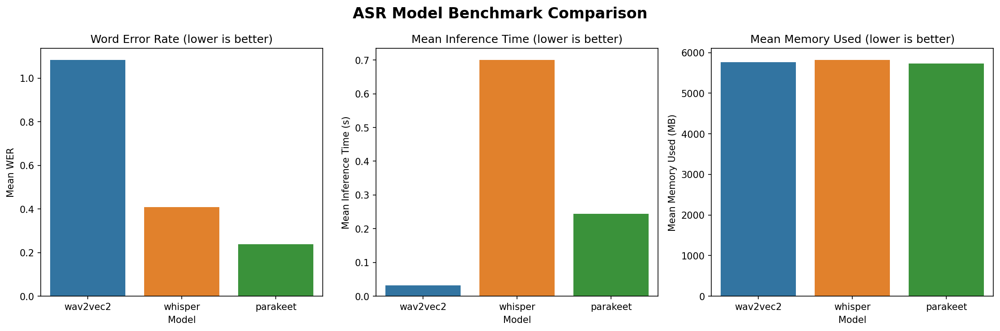

# ASR Models Benchmarking - Customer Support Voice AI Assistant

A comparative study of Speech-to-Text models for noisy, real-world audio in a customer support call environment.

---

## Problem Statement

Voice-based AI assistants for customer support operate in challenging conditions - background noise, multiple accents, conversational speech patterns, and long call durations. This study evaluates three state-of-the-art open-source ASR models to identify the best candidate for production deployment in such an environment.

---

## Models Evaluated

### Wav2Vec2 Base 960h — Meta AI
| | |
|---|---|
| **Architecture** | Self-supervised CNN feature extractor + Transformer encoder + CTC head. Processes raw waveform directly — no mel spectrogram conversion needed. |
| **Parameters** | ~95M |
| **Training Data** | Pre‑trained on ~53k hours of unlabelled LibriSpeech, then fine‑tuned on the 960‑hour labelled LibriSpeech subset |
| **Licensing** | Apache‑2.0 |
| **Hardware Requirements** | Lightweight — runs on CPU; GPU recommended for speed. |
| **Strengths** | Fastest inference; minimal dependencies; good baseline for fine-tuning on domain-specific data |
| **Weaknesses** | Struggles significantly with noisy audio and accents out-of-the-box; no punctuation or text normalization in output; high WER on conversational speech |

---

### Whisper Small — OpenAI
| | |
|---|---|
| **Architecture** | Encoder-Decoder Transformer. Converts audio to mel spectrogram → encoder builds contextual representation → decoder generates text autoregressively. |
| **Parameters** | ~244M |
| **Training Data** | 680,000 hours of multilingual, weakly supervised web audio — highly diverse in accents, languages, and recording conditions. |
| **Licensing** | MIT - fully open source, commercial use permitted |
| **Hardware Requirements** | Moderate - GPU recommended; runs on CPU but slow. Compatible with standard HuggingFace inference pipelines. |
| **Strengths** | Excellent multilingual performance and accent robustness; built-in punctuation and text normalization; production-ready output with no post-processing |
| **Weaknesses** | Slower inference than CTC-based models; fixed 30-second input window requires padding for short clips |

---

### Parakeet TDT 1.1B — NVIDIA
| | |
|---|---|
| **Architecture** | Conformer encoder (combines convolution + self-attention for local and global audio patterns) + RNN-Transducer decoder with Token and Duration Transducer (TDT) loss — optimized for streaming and low-latency inference. |
| **Parameters** | ~1.1B |
| **Training Data** | About 64k hours of English speech (NVIDIA‑curated + LibriSpeech‑family datasets) |
| **Licensing** | CC-BY-4.0 |
| **Hardware Requirements** | GPU required; ~5.7GB peak VRAM. Requires NVIDIA NeMo toolkit installation (~heavy dependency chain). |
| **Strengths** | Best raw WER on noisy audio; fast inference; real-time streaming capable; trained on People's Speech (same dataset used here) |
| **Weaknesses** | Outputs numbers as spoken words ("one nine hundred sixty s") — requires text normalization post-processing; NeMo dependency adds deployment complexity |


**Models considered but excluded:**
- **Whisper Large V3 Turbo** — Superior performance but too memory-intensive for reproducible benchmarking on Colab T4.
- **Distil-Whisper** — Shares encoder-decoder architecture with Whisper Small; insufficient architectural diversity.
- **Gnani.ai Vachana ASR** — No open-source weights available. Strong contender for Indic language deployments but outside scope of this benchmark.

---

## Dataset

**[People's Speech](https://huggingface.co/datasets/MLCommons/peoples_speech) — dirty, test split**

- Crowd-sourced, real-world audio with background noise, varied recording quality, and natural conversational speech (pauses, stammers) — directly representative of customer call conditions.
- The `test` split was used to avoid data leakage, as train splits may overlap with model pre-training pipelines.
- Streaming mode with `take(100)` was used for efficient sampling without downloading the full dataset (~2.12TB).
- Used in training / finetuning NVIDIA's Parakeet, Nemotron and Canary models, validating its relevance as an ASR benchmark dataset.

---

## Metrics

| Metric | Description |
|---|---|
| **Word Error Rate (WER)** | Primary accuracy metric — lower is better |
| **Mean Inference Time (s)** | Average time per audio sample — lower is better |
| **Peak GPU Memory (MB)** | Peak CUDA memory allocated during inference |
| **Setup Complexity** | Dependencies, processing steps, hardware requirements, etc. |

---

## Results

| Model | Mean WER ↓ | Mean Inference Time (s) ↓ | Peak Memory (MB) | Setup Complexity |
|---|---|---|---|---|
| Wav2Vec2 Base | 1.0825 | 0.0319 | 5767.93 | Low - HuggingFace native, minimal dependencies |
| **Whisper Small** | **0.4082** | **0.6998** | **5815.81** | Low - HuggingFace native, minimal dependencies |
| Parakeet TDT 1.1B | 0.2381 | 0.2447 | 5736.27 | Moderate — Requires NVIDIA NeMo toolkit (heavy install) |



---

## Comparative Analysis

| Criterion | Wav2Vec2 Base 960h | Whisper Small | Parakeet TDT 1.1B |
|---|---|---|---|
| **Accuracy (WER ↓)** | 1.08 - Poor on noisy conversational audio | 0.41 - Good; punctuation adds readability beyond raw WER | 0.24 - Best raw WER; numbers spoken verbatim |
| **Latency** | 0.03s - Fastest but unusable accuracy | 0.70s - Slowest; acceptable for async transcription | 0.24s - Best balance of speed and accuracy |
| **Resource Usage** | 5767 MB peak GPU | 5815 MB peak GPU | 5736 MB peak GPU |
| **Ease of Deployment** | ✅ Easy - HuggingFace native, minimal dependencies | ✅ Easy - HuggingFace native, minimal dependencies | ⚠️ Moderate - Requires NVIDIA NeMo toolkit (~heavy install) |
| **Suitability for Noisy Audio** | ❌ Poor - Struggles significantly with noise and accents | ✅ Good - Robust to noise; handles accents and natural speech well | ✅ Good - Strong on noisy audio; designed for real-world speech |

---

## Qualitative Analysis

A single sample illustrates key behavioral differences across models:

**Reference Text:**
> *that's where you have a lot of windows in the south no actually that's passive solar and passive solar is something that was developed and designed in the 1960s and 70s and it was a great thing for what it was at the time but it's not a passive house*

| Model | Transcription | Observation |
|---|---|---|
| Wav2Vec2 | `ET'S WE HAVE A LOT OF WINDOWS IN THE SOUTH NO ACTION...` | All-caps, missing punctuation, word-level errors |
| Whisper Small | `That's where you have a lot of windows in the south. No, actually...` | Correct punctuation, readable, numbers as digits |
| Parakeet TDT | `that's where you have a lot of windows in the south no actually...one nine hundred sixty s...` | Lowest WER, but numbers spoken verbatim |

**Key insight:** WER alone is insufficient for production evaluation. Parakeet achieves a lower WER partly because it closely mirrors the reference text's unpunctuated, lowercased style; its "accuracy" is an artifact of the benchmark format, not a reflection of real-world output quality. Whisper's added punctuation and number normalization are technically penalized as "errors" by WER, yet they are precisely the qualities that make transcriptions usable in production. For customer support specifically, where agents and downstream NLP systems depend on readable, structured text, Whisper's output is meaningfully superior.

---

## Recommendation

**Whisper Small** is recommended for production deployment in this customer support use case.

While Parakeet TDT 1.1B achieves a lower raw WER, this advantage is misleading in context:

- **Punctuation:** Whisper produces properly punctuated, sentence-structured output. Parakeet outputs a continuous stream of unpunctuated text, unusable for agents reading transcripts or for downstream NLP tasks like sentiment analysis and intent detection.
- **Number normalization:** Customer support calls frequently involve dates, order IDs, prices, and account numbers. Whisper correctly formats these as digits ("1960s and 70s"); Parakeet reads them verbatim ("one nine hundred sixty s"), requiring additional post-processing to be usable.
- **WER is misleading here:** Parakeet's lower WER is partly an artifact of matching the reference text's raw speech style. Whisper's "errors" (punctuation, capitalization, digit formatting) are improvements, not mistakes.
- **Production readiness:** Whisper's output is deployment-ready with minimal post-processing. Recommending Parakeet would mean building Whisper's output quality manually, adding engineering overhead with no net benefit.

**Parakeet TDT 1.1B** remains a strong contender for latency-critical or streaming use cases where a text normalization layer is added downstream, or where raw speech fidelity is the primary requirement.

### Optimization Recommendations

- **Quantization:** Apply INT8 quantization to Whisper Small to reduce memory footprint and improve inference speed without significant accuracy loss.
- **Fine-tuning strategy:** Fine-tune on domain-specific customer support audio using LoRA/PEFT to improve accuracy on industry terminology, accents, and call center noise profiles.
- **VAD integration:** Add Voice Activity Detection (VAD) pre-processing to skip silence and reduce unnecessary inference calls.
- **Batched inference:** For non-real-time use cases (call recording transcription), batch multiple audio clips to improve GPU utilization.
- **Upgrade path:** For higher accuracy requirements, Whisper Large V3 Turbo offers near-identical output style with significantly improved WER, a natural next step once hardware constraints allow.

### Proposed Production Architecture

```
Customer Call Audio
        ↓
  VAD Pre-processing         ← Strip silence
        ↓
  Whisper Small              ← ASR inference (INT8 quantized)
        ↓
  Downstream NLP Pipeline    ← Sentiment, intent, summarization, etc.
```

---

## Repository Structure

```
immverseai-asr-benchmark/
├── notebooks/
│   └── task_asr_benchmarks.ipynb     # Full benchmarking notebook (Colab)
├── results/
│   ├── benchmark_results.csv         # Aggregated metrics
│   └── benchmark_comparison.png      # Bar chart visualization
├── scripts/
│   └── task_asr_benchmarks.py        # Exported Python script of the benchmarking notebook (Colab)
└── README.md
```

---

## Hardware & Environment

| | |
|---|---|
| **GPU** | Google Colab T4 (16GB VRAM) |
| **Python** | Python3 |
| **Key Libraries** | `transformers`, `nemo_toolkit[asr]`, `datasets`, `jiwer`, `torch` |
| **Dataset** | MLCommons/peoples_speech (dirty, test, 100 samples) |
